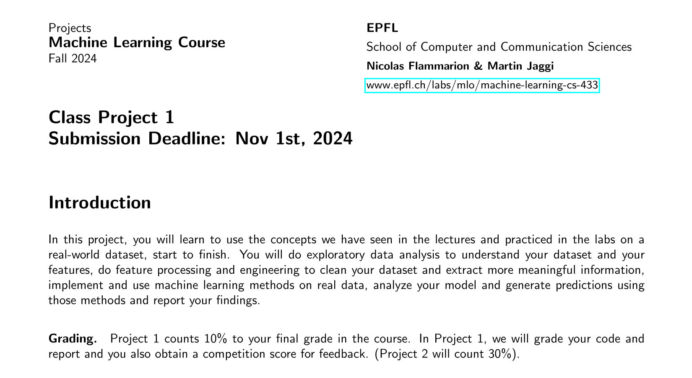

# Heart Disease Prediction - Class Project 1

<h3 align="center">
    
</h3>

## Overview

This project aims to predict heart disease risk using health survey data from the *Behavioral Risk Factor Surveillance System* (BRFSS). We implement logistic regression and apply it to predict myocardial infarction risk based on lifestyle and health factors.

This project is part of the EPFL Machine Learning Course (CS-433).

## Setup Instructions

To train the model and generate predictions:

1. Download the dataset and place the CSV files (`x_train.csv`, `y_train.csv`, `x_test.csv`) in the `data/` directory

2. Execute the following commands:

```bash
cd epfl-ml-project-1
python -m venv .venv
source .venv/bin/activate
pip install -r requirements.txt

python src/run.py
```
3. The script will:

- Preprocess the data
- Train the model
- Generate predictions
- Output performance metrics

## Results

The final model achieves a balanced accuracy of $0.717$ and an F1-score of $0.327$.

These results can be seen in the `report/` and on the [AICrowd leaderboard](https://www.aicrowd.com/challenges/epfl-machine-learning-project-1).
